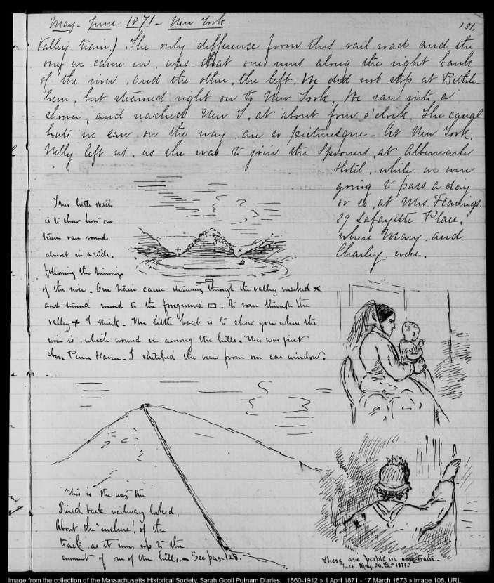
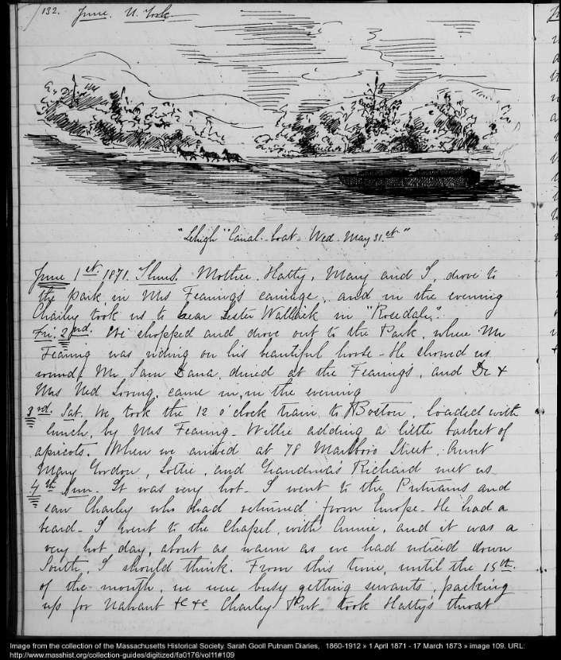
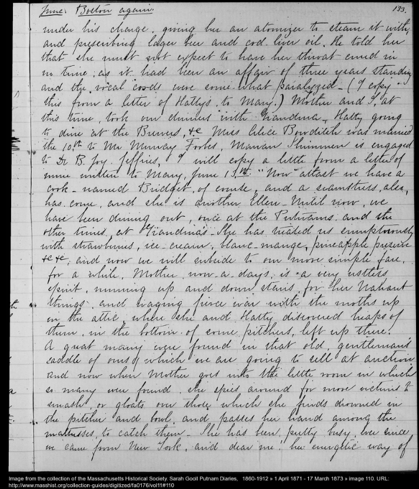
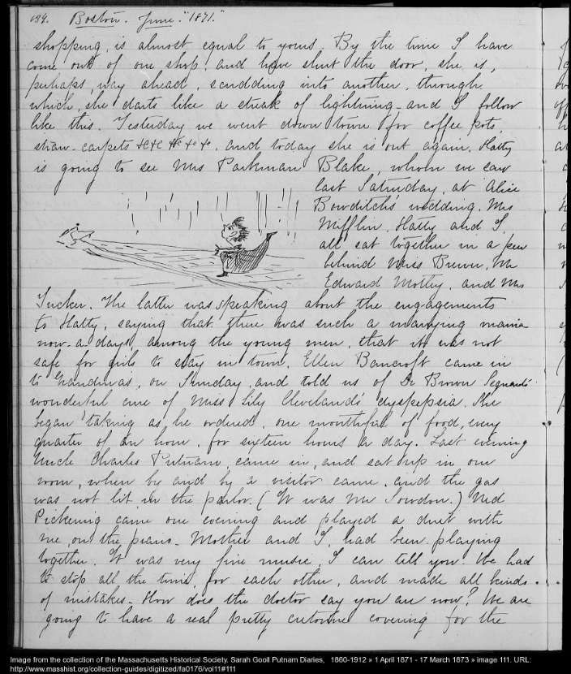

+++
title = "Post01"
date = 2025-03-11T21:21:51-04:00
type = "post"
tags = ["Transcription", "Putnam"]
+++

Sarah Gooll Putnam Diaries - Introduction

April 28th, 2025

The Massachusetts Historical Society (MHS) is a nonprofit organization devoted to analyzing and collecting materials which further the understanding of the history of Massachusetts. Within their collection are the diaries of Sarah Gooll Putnam (1851-1912). Putnam was a Boston born painter who studied in New York, Munich, and Holland, painted mostly with oil based paint, and documented her life in twenty-eight volumes of diaries starting at the age of nine. She was very well traveled, and recorded her visits to Europe, the American south and west. Her notes are full of sketches of what she had seen at the time of a given entry.

Scans of Putnam’s diaries are available to the public, and the MHS has begun a digital volunteer project to transcribe all twenty-eight volumes. The text below is my own transcription effort and is not a final or official MHS version of her work. Still, as I read through her travels, I found a clear window into the past. The beats of her narrative and the pacing of her words bring the late 19th and early 20th centuries to the present and at times read like an authentic, in-person conversion. It is interesting to discover how locations, activities, and experiences in her pages contain similarities between her life and the present as well as how they reveal the time in which the dairies were written.

Below are the most recent crowd-sourced transcriptions I have completed, and have not been finalized by MHS. These particular four pages Vol. 11, Image 108 to 111 are dated to May and June of 1871.

---

**Vol. 11, 1 April 1871 - 17 March 1873, Image 108**

[1871-05-31]

131

May-June. 1871 -- New York

Valley train. The only difference from this rail-road and the one we came in, was that one went along the right bank of the river, and the other, the left. We did not stop at Bethlehem, but steamed right on to New York, We ran into a shower, and reached New Y. at about four o'clock. The canal boats we saw on the way, are so picturesque -- At New York, Nelly left us, as she was to join the Spooners, at Albemarle [drawing 1] Hotel, while we were going to pass a day or so, at Mrs. Fearings, 29 Lafayette Place, where Mary, and Charley, were. [drawings 2, 3]

[drawing 1: train route along river with locations marked by symbols for reference; caption: This little sketch is to show how our train ran round almost in a circle, following the turnings of the river. Our train came steaming through the valley marked X, and turned round to the foreground []. It ran through the valley + I think -- The little boat is to show you where the river is, which wound in among the hills. This was just above Penn Haven. I sketched the view from our car window.]

[drawing 2: seated woman with baby; woman from behind with raised arm; caption: These are people in our train. Tues. May 30th. "1871."]

[drawing 3: train track on hill; caption: This is the way the Switch back railway looked, About the 'incline,' of the track, as it runs up to the summit of one of the hills. -- See page 128.]

[1871-06-01 / 1871-06-02 / 1871-06-03 / 1871-06-04]

---

**Vol. 11, 1 April 1871 - 17 March 1873, Image 109**

June. N. York.

[drawing 1]

June 1st. 1871. Thurs. Mother, Hatty, Mary and I, drove to the park, in Mrs Fearing's carriage, and in the evening Charley took us to hear Lester Wallack in "Rosedale."

Fri. 2nd. We shopped and drove out to the Park, where Mr Fearing was riding on his beautiful horse -- He showed us round. Mr Sam Dana, dined at the Fearings, and Dr & Mrs Ned Loring, came in, in the evening

3rd. Sat. We took the 12 o'clock train to Boston, loaded with lunch, by Mrs Fearing -- Willie adding a little basket of apricots. When we arrived at 78 Marlboro Street, Aunt Mary Gordon, Lottie, and Grandma's Richard met us.

4th. Sun. It was very hot -- I went to the Putnams and saw Charley who had returned from Europe. He had a beard. I went to the chapel with Annie, and it was a very hot day, about as warm as we had noticed down South, I should think. From this time, until the 15th. of the month, we were busy getting servants, packing up for Nahant etc etc. Charley Put took Hatty's throat [break]

[drawing 1: Landscape with hills in background and horses pulling a boat along a canal; caption: "Lehigh" Canal-boat. Wed. May 31st."]

---

**Vol. 11, 1 April 1871 - 17 March 1873, Image 110**

[1871-06-04]

133

June. Boston again.

under his charge, giving her an atomizer to steam it with, prescribing lager beer and cod-liver oil. He told her that she must not expect to have her throat cured in no time, as it had been an affair of three years standing and the vocal cords were some-what paralyzed -- (I copy this from a letter of Hatty's, to Mary.) Mother and I, at this time, took our dinners with Grandma -- Hatty going to dine at the Brewers, etc. Miss Alice Bowditch was married the 10th. to Mr Murray Forbes, Marian Shimmen is engaged to Dr B. Joy. Jeffries, I will copy a little from a letter of mine written to Mary, June 13th. "Now atlast we have a cook -- named Bridget, of course, and a seamstress, also, has come, and she is another Ellen -- Until now, we have been dining out, once at the Putnams, and the other times at Grandma's -- She has treated us sumptuously with strawberries, ice-cream, blanc-mange, pineapple preserve etc etc; and now we will subside to our more simple fare, for a while, Mother, now-a-days, is a very restless spirit, running up and down stairs, for her Nahant things, and waging fierce war with the moths up in the attic, where she and Hatty discovered heaps of them, in the bottom of some pitchers, left up there. A great many were found in that old, gentleman's saddle of ours which we are going to sell at auction, and now when Mother goes into the little room in which so many were found, she spies around for more victims to smash, or gloats over those which she finds drowned in the pitcher and bowl, and passes her hand among the mattresses, to catch them -- She has been pretty busy, ever since we came from New York, and dear me! her energetic way of [break]

---

**Vol. 11, 1 April 1871 - 17 March 1873, Image 111**

[1871-06-04]

134

Boston. June. "1871."

shopping, is almost equal to yours. By the time I have come out of one shop, and have shut the door, she is, perhaps, way ahead, scudding into another, through which, she darts like a streak of lighting -- and I follow like this. Yesterday we went down town for coffee pots, straw-carpets etc etc etc etc etc, and today she is out again. Hatty is going to see Mrs Parkman Blake, whom we saw [drawing] last Saturday, at Alice Bowditch's wedding. Mrs Mifflin, Hatty, and I, all sat together in a pew behind Miss Brewer, Mr Edward Motley, and Mrs Tucker. The latter was speaking about the engagements to Hatty, saying that there was such a marrying mania now-a-days, among the young men, that it was not safe for girls to stay in town. Ellen Bancroft came in to Grandma's, on Sunday, and told us of Dr Brown Seguard's wonderful cure of Miss Lily Cleveland's dyspepsia. She began taking as he ordered, one mouthful of food, every quarter of an hour, for sixteen hours a day. Last evening Uncle Charles Putnam, came in, and sat up in our room, when by and by a visitor came, and the gas was not lit, in the parlor. (It was Mr Sowdon.) Ned Pickering came one evening and played a duet with me, on the piano. Mother and I, had been playing together. It was very fine music, I can tell you. We had to stop all the time, for each other, and made all kinds of mistakes. How does the doctor say you are now? We are going to have a real pretty cutonne covering for the [break]

[drawing: cartoon depiction of Sally running after her mother in a shopping frenzy]

**

